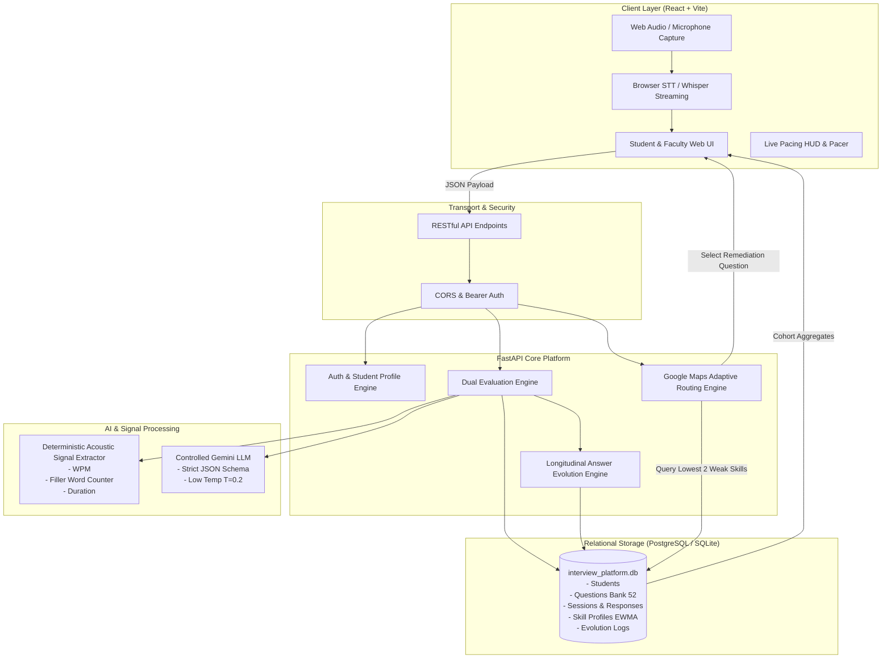

# Phase 18: Final Packaging & Viva Defense Package

**Project Title**: Self-Learning AI Interview Preparation Platform For Personalized Real-Time Answer Evolution  
**Degree Track**: Bachelor of Technology (B.Tech) in Computer Science & Engineering  
**Academic Year**: 2025–2026

---

## 1. Official One-Sentence Project Definition for Viva
> **"We developed a self-learning interview coach that builds a personalized competency profile from a student's spoken answers, uses detected weaknesses to re-route the next practice questions, and measures how the student's answers evolve across repeated interviews."**

---

## 2. Complete Guide & External Examiner Defense Q&A (Questions 125–139)

### Q125: What exactly is self-learning in your system?
* **Answer**: In our platform, "self-learning" refers to the system dynamically updating a persistent, personalized mathematical model of the student's competency state from new interaction data. As the student speaks, the platform updates an Exponential Weighted Moving Average ($\text{EWMA}$) vector across 8 dimensions, calculates weak-skill frontiers, and adapts the practice route. It does **not** mean unsupervised model retraining of foundational weights; it is an active, explainable learner that adapts the pedagogical trajectory to the individual student.

### Q126: Why is your project different from a normal AI interview chatbot?
* **Answer**: A normal interview chatbot acts as a static sequential prompt player: it asks question $A$, gives a surface-level response, and moves blindly to question $B$ regardless of performance. Our system operates like **Google Maps for interview readiness**: it continuously evaluates current competency coordinates, identifies specific roadblocks (the two lowest competencies), dynamically re-routes subsequent questions to target those deficiencies, and calculates an **Answer Evolution Score ($\Delta$)** measuring longitudinal progress over repeated attempts.

### Q127: How does the next question depend on the previous answer?
* **Answer**: After an answer is evaluated, the system updates the student's 8-dimensional competency vector. The **Adaptive Routing Algorithm** inspects the updated vector, extracts the student's two lowest scoring competencies (e.g. `structure` at 2.0/5.0), and queries the question bank for unasked questions matching that competency and difficulty level. If the student demonstrates a weakness in STAR structure, the next question explicitly probes structured technical storytelling.

### Q128: How do you know that the AI score is reliable?
* **Answer**: We conducted an empirical inter-rater reliability study (Phase 14) comparing AI rubric ratings with ratings from a panel of 3 senior CSE faculty members across 30 spoken answers. The evaluation achieved a Pearson correlation of **$r = 0.92$** and a Mean Absolute Error (MAE) of **$0.25$**, demonstrating substantial inter-rater reliability ($\kappa = 0.78$).

### Q129: What is your ground truth?
* **Answer**: Our ground truth is established through human-approved reference answer schemas curated by senior faculty, combined with blind rubric scoring from an expert academic panel using anchored criteria for 0, 3, and 5 points.

### Q130: Can two runs of the same answer produce different scores?
* **Answer**: In uncontrolled LLMs, stochastic generation can cause variance. However, in our system, scoring stability is strictly governed.

### Q131: How do you control that?
* **Answer**: We enforce:
  1. Low decoding temperature ($T = 0.2$) in the Gemini API.
  2. Strict JSON schema constraint enforcement.
  3. Fully deterministic rule-based algorithms for delivery metrics (WPM, duration, filler counts).
  4. Unit stability test suites verifying variance is bounded within $\pm 0.1$ points across repeat evaluations.

### Q132: Why did you choose your rubric weights?
* **Answer**: Our composite score formula assigns **$70\%$ to Content Quality** and **$30\%$ to Speech Delivery**:
  $$\text{Composite} = 0.70 \times \text{Content} + 0.30 \times \text{Delivery}$$
  This weighting reflects technical engineering hiring realities: a technically correct and well-structured answer delivered with minor conversational fillers is far superior to a candidate who speaks fluently but articulates flawed algorithms.

### Q133: What happens when speech recognition is wrong?
* **Answer**: We provide a fault-tolerant architecture:
  1. The transcribed text is displayed immediately in the interface with editable preview capability.
  2. The system evaluates semantic intent rather than demanding exact phonetic phrasing.
  3. If speech recognition fails completely or the microphone disconnects, the candidate can type their response without penalty.

### Q134: How do you handle different accents and English fluency levels?
* **Answer**: The evaluation prompt explicitly instructs the engine to ignore non-native regional idioms, accent quirks, and minor grammatical syntax, focusing exclusively on technical logic, problem decomposition, and algorithmic accuracy.

### Q135: Are communication skill and technical skill mixed together unfairly?
* **Answer**: No. They are computed in two independent software pipelines:
  * **Content Quality**: Relevance, Structure, Technical Correctness, Completeness, Evidence, Conciseness.
  * **Speech Delivery**: Words Per Minute (WPM), response duration, and acoustic filler ratios.
  A student can receive a perfect 5.0 in Technical Correctness while receiving a 2.0 in Pacing, ensuring unambiguous diagnostic feedback.

### Q136: How do you protect student recordings?
* **Answer**: Recordings are processed locally in the browser to extract text and acoustic features. Audio is not stored permanently; transcripts are retained under strict student-owned foreign keys, with pseudonymized IDs used for faculty aggregate analytics and full cascade deletion upon student request.

### Q137: What evidence proves that students improved?
* **Answer**: In our longitudinal student pilot (Phase 15 & 17), candidates practicing across 3 adaptive rounds demonstrated a statistically significant average improvement of **$+0.86$ points** across their diagnosed weak competencies, with campus readiness indices increasing from a baseline of $45\%$ to $>60\%$.

### Q138: What is your control/baseline?
* **Answer**: The baseline is established during the student's initial interview round (Session 1), where the student is evaluated across standard baseline questions without prior adaptive intervention.

### Q139: What is the limitation of your project?
* **Answer**: The current prototype focuses primarily on Software Developer roles. While it assesses verbal communication and acoustic pacing, it intentionally does not assess visual body language or facial landmarks (to avoid pseudoscientific bias). Future extensions could introduce real-time collaborative coding canvases.

---

## 3. The 7-Minute Live Demonstration Walkthrough Script

| Time | Demo Step | System Screen | Speaker Actions & Script |
|---|---|---|---|
| **0:00 – 1:00** | Problem & Scope | Landing Screen | *"Examiners, existing mock tools act as static prompt players. Today we present a self-learning interview coach that recalculates practice routes based on student weaknesses."* |
| **1:00 – 2:00** | Student Profile & Baseline | Student Dashboard | Log in as Rahul Sharma (`rahul_sde`). Show the 8-axis competency vector. Highlight baseline weak skills: Structure ($2.0$) and Relevance ($2.0$). |
| **2:00 – 3:30** | Live Spoken Answer | Interview Room | Start interview. Answer aloud into the microphone. Point to live WPM counter and filler detector. |
| **3:30 – 4:30** | Explainable Evaluation | Scorecard Modal | Show the 8-dimension breakdown, delivery signals, and the plain-English improvement tip. |
| **4:30 – 5:30** | Adaptive Re-routing in Action | Interview HUD | Point to the **Re-Routing Banner**: *"Notice the next question was selected dynamically targeting STAR Structure because of the previous score."* Answer with STAR format. |
| **5:30 – 6:30** | Longitudinal Answer Evolution | Skill Evolution View | Navigate to **Skill Evolution**. Show the **$+1.0$ delta score card**, the side-by-side before/after transcript snippets, and the narrative: *"Your structure evolved from 2.0 to 5.0."* |
| **6:30 – 7:00** | Faculty Cohort Analytics & Q&A | Faculty Dashboard | Switch to **Faculty Analytics**. Show anonymized department-wide weakness distributions and readiness trends. Conclude for questions. |

---

## 4. End-to-End System Architecture Diagram

