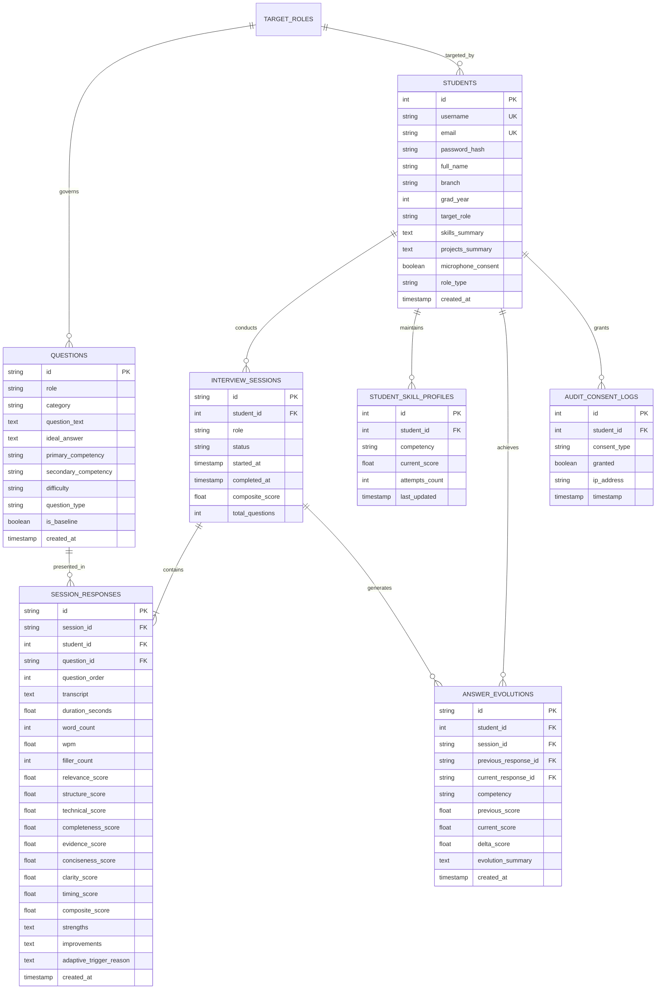

# Phase 4: Entity-Relationship (ER) Architecture and Data Dictionary

**Project Milestone**: Relational Database Architecture  
**Database Engines Supported**: SQLite3 (Local Prototyping & CI) & PostgreSQL 15+ (Production College Server)

---

## 1. Entity-Relationship (ER) Diagram

---

## 2. Key Data Integrity & Design Rules

1. **Foreign Key Cascade Deletion**: Deleting a student record cascades to associated sessions, skill profiles, and evolution logs to respect university privacy and right-to-be-forgotten guidelines.
2. **Deterministic Uniqueness**: `student_skill_profiles` enforces `UNIQUE(student_id, competency)` ensuring that each competency per student has exactly one canonical updated moving-average score.
3. **Audit Trail Immutability**: `audit_consent_logs` records all permissions (e.g. microphone access consent) with timestamps and pseudo-IP addresses to satisfy ethical academic guidelines.
4. **Adaptive Routing Query Indexing**: `CREATE INDEX idx_questions_comp_diff ON questions(primary_competency, difficulty, role)` ensures $O(1)$ indexed retrieval of remedial practice questions during live interviews.
